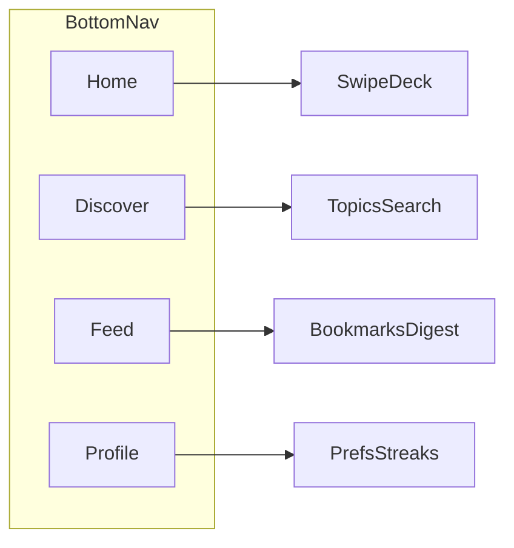

# AI News Swipe — Figma UI specification

**Audience:** Product designers and design engineers building the mobile UI in Figma.  
**Use:** Single source of truth for frames, components, variables, and retention surfaces. Split into Figma pages or FigJam sections as needed.

**Engineering alignment:** Feed payload today is `GET /feed` on the backend (`SwipeCard`: `title`, `url`, `summary`, `description`, `published_at`, `source_id`, `source_name`, `credibility`, `scores`). Visuals should not assume fields that do not exist yet (e.g. avatars for outlets) unless labeled *future*.

---

## 1. Product summary

**AI News Swipe** is a **mobile-first** app for busy people who want **curated AI and tech intelligence**, not an endless aggregator. Editorial tone: **trust, clarity, signal over noise**. The backend enforces a **small allowlist of sources**, ranking, and optional LLM summaries; the UI must reinforce **credibility** and **habit** so users return daily.

**Design north star**

- **Premium dark editorial:** full-screen **vertical gradient** background (reference: **vibrant burnt orange / copper** toward the top transitioning to **deep forest green / near-black** toward the bottom). Figma: define as a linear gradient token, 180° (top to bottom), with at least two mid-stops for richness.
- **Glass / frosted surfaces:** primary content sits on **rounded rectangles** with **white or light gray at 8–16% opacity** (or solid white cards with subtle shadow) so text remains readable. Avoid flat gray slabs; prefer depth and separation from the gradient.
- **Typography:** modern **humanist or neo-grotesque sans** (e.g. Inter, SF Pro, or similar); strong hierarchy for headlines vs. body.

**Visual reference (mandatory for art direction)**

- Place the approved **“The News”** three-screen mockup in Figma as a pinned reference. If the PNG is added to the repo, use: `assets/reference/the-news-mockup.png` (create `assets/reference/` if missing). All **bottom navigation** decisions must match that reference unless product explicitly approves a deviation.

---

## 2. Design tokens (Figma variables)

Create a **Variable collection** (e.g. `AI News / Core`) with modes **Light** not required for v1 — **Dark only** for MVP.

### 2.1 Color

| Token | Usage | Notes |
|-------|--------|--------|
| `bg/gradient-top` | Background top stop | Burnt orange / copper |
| `bg/gradient-mid` | Optional mid stop | Warm brown or deep amber |
| `bg/gradient-bottom` | Background bottom stop | Deep green-black |
| `surface/glass` | Cards, chips, secondary panels | White `#FFFFFF` at **8–16%** opacity over gradient; blur optional in implementation |
| `surface/solid` | High-readability zones | Near-white or solid white for dense text (use sparingly) |
| `text/primary` | Headlines, nav active label | White or `#F5F5F5` |
| `text/secondary` | Subcopy, metadata | White ~70% opacity |
| `text/inverse` | Text on solid white tiles | Near-black |
| `nav/pill-outer` | Bottom bar container | Near-black `#0A0A0A` or **92–98%** opacity black |
| `nav/pill-inner-active` | Active tab inner pill | Slightly **lighter** dark than outer (e.g. `#1F1F1F` or elevated opacity) |
| `icon/nav` | Inactive nav icons | White line icons |
| `accent/primary` | Primary CTA, key highlights | Copper / orange aligned with gradient top |
| `accent/danger` | Live, breaking urgency | Saturated red; use sparingly |
| `credibility/official` | Official / lab sources | Cool teal or blue-green (trust) |
| `credibility/news` | Editorial outlets | Neutral blue or slate |
| `credibility/community` | GitHub, Product Hunt, forums | Warm violet or amber (distinct from `accent/primary`) |

**Backend mapping (do not rename in UI without API change)**

| `credibility` value | UI |
|---------------------|-----|
| `official` | `credibility/official` chip + label “Official” |
| `news` | `credibility/news` chip + label “News” |
| `community` | `credibility/community` chip + label “Community” |

### 2.2 Typography

| Role | Typical use | Weight | Size (375pt width baseline) |
|------|-------------|--------|-----------------------------|
| Display | Marketing / empty states | Bold | 28–34 |
| H1 | Screen titles (“Headlines”) | Bold | 22–26 |
| H2 | Card titles | Semibold | 17–20 |
| Body | Summary, descriptions | Regular | 15–16 |
| Caption | Source, time, scores | Medium | 12–13 |
| Label | Nav, chips, buttons | Semibold | 11–13 |

Line height: **1.25–1.35** for titles; **1.45–1.55** for body on dark.

### 2.3 Radius

| Token | Suggested value | Usage |
|-------|-----------------|--------|
| `radius/card` | 16–20 | Category tiles, main cards |
| `radius/chip` | Full pill | Tags, credibility, Live |
| `radius/nav-outer` | 28–36 height implied | **Bottom floating nav** outer container |
| `radius/nav-inner-active` | 20–24 | **Active tab** inner pill |

### 2.4 Elevation and stroke

- **Floating nav:** subtle **drop shadow** (y: 8–16, blur: 24–32, low spread) **or** 1px **border** `white` at 6% opacity so the bar separates from the gradient.
- **Cards:** optional 1px border `white` at 8% for glass definition.

### 2.5 Spacing and grid

- Base unit **4**; common steps **8, 12, 16, 20, 24, 32**.
- Screen horizontal padding: **16–20** from edges.
- Respect **safe areas:** additional **bottom inset** above system home indicator for the **floating nav** (see Section 4).

---

## 3. Information architecture

Four primary destinations map **1:1** to the **floating bottom nav** (reference image).

| Tab | Icon (inactive) | Purpose | Primary screens |
|-----|-------------------|---------|-----------------|
| **Home** | House (line) | Ranked swipe feed, hero, stories | Swipe deck, headlines, “caught up” |
| **Discover** | Globe (line) | Browse topics, search, filters | Topic rails, search results, credibility filter |
| **Feed** | Newspaper / stacked lines (line) | Saved articles and reading queue | Bookmarks list, digest preview |
| **Profile** | Person (line) | Account, habits, settings | Digest schedule, streaks, notifications |

**Navigation rule:** **Active tab** always shows **icon + text label** inside an **inner pill**. **Inactive** tabs show **icon only** (no labels).



---

## 4. Bottom navigation — floating pill (mandatory)

This section is **non-negotiable** for parity with the shared reference and engineering handoff.

### 4.1 Container (outer pill)

- **Shape:** Wide **horizontal pill**; **heavily rounded** corners (capsule-like). Width: **almost full width** with **16–20 pt** horizontal **inset** from screen edges (not edge-to-edge flush).
- **Position:** **Floating** above the bottom of the screen: maintain a **visible gap** (e.g. **10–16 pt**) between the **bottom of the outer pill** and the **physical bottom** / home indicator safe area so gradient shows through (“floating”).
- **Fill:** **Dark** (`nav/pill-outer`): solid or **high-opacity** black so icons remain legible on the orange/green gradient.
- **Z-order:** Above scrolling content; content should **not** slide under unreadable critical text—use **bottom padding** on scroll containers equal to **nav height + float gap + safe area**.

### 4.2 Items (four)

- **Even distribution** along the bar (equal flex).
- **Icons:** **Line art**, **white**, **2 px** stroke at 24×24 icon grid (Figma: use consistent icon set, e.g. SF Symbols–style or custom matching reference).
- **Order (L → R):** Home | Discover | Feed | Profile (confirm with product; swap only if reference dictates).

### 4.3 Active state (inner pill)

- Selected tab: **nested pill** inside the outer bar, **lighter dark** background (`nav/pill-inner-active`).
- Contains **icon + label** (e.g. “Home”) in **primary text** color, **horizontal** arrangement icon-leading.
- **Inactive:** **icon only** (no label text).

### 4.4 Touch and accessibility

- Minimum **44 × 44 pt** touch target per tab (extend hit area beyond visible icon if needed).
- **Contrast:** Inactive icons on `nav/pill-outer` must meet **WCAG AA** for non-text contrast where applicable; active inner pill text **white on dark** ≥ **4.5:1**.
- **Labels:** Expose `accessibilityLabel` per tab (e.g. “Home, selected”).
- **Reduce motion:** Provide non-animated state change (instant color swap) when system “reduce motion” is on.

### 4.5 Anatomy — suggested defaults (Figma auto-layout)

| Element | Suggested value |
|---------|-----------------|
| Outer pill height | **64–72 pt** inclusive of vertical padding |
| Outer pill horizontal padding | **12–16 pt** internal |
| Float gap above home indicator | **10–16 pt** |
| Inner active pill horizontal padding | **14–18 pt** |
| Inner active pill vertical padding | **8–10 pt** |
| Icon size | **24 pt** |
| Gap icon–label (active) | **6–8 pt** |

### 4.6 ASCII wireframe (content above, nav below)

```
┌─────────────────────────────────────┐
│  [ Top bar: search · bell ]   ( ● ) │  ← white pill + avatar
│  ○ ○ ○ ○  (story bubbles + LIVE)   │
│  ┌─────────────────────────────┐   │
│  │  Hero / Headlines card      │   │
│  └─────────────────────────────┘   │
│  ┌─────────────────────────────┐   │
│  │  Swipe card stack            │   │
│  └─────────────────────────────┘   │
│                                     │
│    ╭───────────────────────────╮   │
│    │ [■ Home]  ○    ○    ○     │   │  ← outer dark pill; Home = inner pill
│    ╰───────────────────────────╯   │     Discover Feed Profile = icons only
└─────────────────────────────────────┘
```

---

## 5. Screen-by-screen inventory

For each screen document: **purpose**, **components**, **data** (from API where applicable), **states** (loading / empty / error).

### 5.1 Onboarding — Choose categories

- **Purpose:** Personalization hook; sets expectation of **curated** experience.
- **Components:** Progress indicator (if multi-step), **H1** “Choose Categories”, grid of **category cards** (icon + bold title + short subtitle on **white/light rounded** tiles), full-width **Continue** button (`accent` or dark pill on gradient).
- **Data:** Local selection state only (sync to profile later).
- **States:** None selected → Continue **disabled** or soft-depressed; at least one selected → enabled.

### 5.2 Home

- **Purpose:** Primary **habit loop** — swipe, save, return.
- **Components:**
  - **Top bar:** **White pill** containing **search** (magnifying glass) and **notifications** (bell); **circular avatar** to the right (account / Profile shortcut).
  - **Story bubbles** horizontal scroll: circular thumbnails; optional **Live** badge (`accent/danger`).
  - **Hero / Headlines** large card: image, **H1** section label, headline text, optional **Breaking** chip.
  - **Swipe stack:** Primary card + peek of next card (`SwipeCard`: `title`, `summary`, `source_name`, `published_at`, `credibility`; optional secondary line for scores *future / debug*).
- **States:** Skeleton for hero + cards; empty → illustration + “Run ingest” is dev-only — user-facing: “No stories yet, pull to refresh.”

### 5.3 Swipe card (component)

- **Purpose:** Single unit of consumption; must communicate **trust** quickly.
- **Layout suggestions:** Title (H2) → **credibility chip** + source name row → summary (Body) → optional metadata (Caption: relative time).
- **Actions (visible or gesture):**
  - **Save** (heart or bookmark) → retention hook; toast “Saved to Feed.”
  - **Share** sheet.
  - **Open source** → external browser (primary `url`).
- **Gestures:** See Section 7 (default: **right = save**, **left = skip** — confirm with product).

### 5.4 Discover

- **Purpose:** Exploration and **trust filtering** (credibility filter = differentiation).
- **Components:** Search field, **horizontal topic chips**, list or grid of items (can reuse compact card).
- **States:** No results empty state; search debounce indicator.

### 5.5 Feed (saved / reading list)

- **Purpose:** **Return path** — bookmarked items from Home.
- **Components:** List of saved cards (thumbnail optional *future*), swipe-to-delete optional, **digest preview** card at top (*future* link to Profile).
- **States:** **Empty:** illustration + “Nothing saved yet” + CTA **Browse Home**.

### 5.6 Profile

- **Purpose:** **Habit and control** — digest, notifications, topics, streak.
- **Components:** Avatar, display name, **streak** module, **daily digest** time picker, toggles (breaking vs digest), **your topics** ( mirrors onboarding ), legal / about.
- **States:** Notifications denied → educates to open Settings.

### 5.7 Article / reader (v1.5)

- **Default for v1:** Open **`url`** in **system in-app browser** or Safari/Chrome (specify in dev handoff). Optional later: reader mode frame in-app.

---

## 6. Retention hooks — UI mapping

Design each row so **PM and design** share one vocabulary.

| Hook | Primary UI surface | Behavior / copy notes | Success signal (design proxy) |
|------|---------------------|------------------------|--------------------------------|
| **Daily digest** | Profile: time + days; optional **Home** “Today’s briefing” card | After **first save**, soft prompt: “Get a daily digest?” → notification permission | Digest opt-in rate |
| **Swipe habit loop** | Home stack; **end-of-deck** sheet: “You’re caught up” + **next refresh** countdown or “New in Xh” | Satisfying motion (Section 7); avoid shame if deck empty | Sessions per week |
| **Bookmarks** | **Feed** tab; **Save** on card + toast | Undo snackbar optional (5s) | Saves per session |
| **Streaks** | Profile **header** + optional small **Home** streak chip | If broken: **non-punitive** copy (“Start a new streak today”) | Streak display taps |
| **Personalization** | Onboarding categories + Profile “Your topics” | When filters apply: banner “Showing more: Models” (*future*) | Category completion |
| **Trust / credibility** | **Chip on every card**; Discover **filter** by tier | Tooltip or info sheet: “What Official means” | Filter usage |
| **Notifications** | Top bar **bell**; Profile **granular toggles** | Breaking vs digest vs marketing (if any) | Permission grants |

---

## 7. Motion and micro-interactions

| Interaction | Direction / notes | Suggested timing |
|-------------|-------------------|-------------------|
| Swipe skip | Drag left, card exits with slight **rotation** (2–6°) and **scale** down | 220–320 ms ease-out |
| Swipe save | Drag right, **accent** edge glow or checkmark reveal | Same |
| Next card | **Parallax** peek of following card (8–12 pt vertical offset) | — |
| Tab change | **Cross-fade** content **or** horizontal slide **150–250 ms** | Respect reduce motion |
| Active nav pill | **Width morph** + background cross-fade **200–280 ms** | Inner pill grows to fit label |

**Open decision (flag in Figma):** Confirm **save = right** vs **up** for ergonomics; document chosen gesture map on a dedicated “Motion” page.

---

## 8. Edge cases and system states

- **Loading:** Skeleton placeholders for hero, story row, and first card; shimmer optional (keep subtle on dark gradient).
- **Empty feed:** Friendly copy + primary button **Refresh**; secondary **Check connection**.
- **Error:** Inline banner with retry; do not block entire gradient with modal unless critical.
- **First-run vs returning:** Onboarding only once; Home shows **full deck** for returning users with streak/digest entry points as configured.

---

## 9. Figma handoff checklist

- [ ] Variable collection: color, type, radius, spacing (Section 2).
- [ ] Component set: **BottomNavFloatingPill** (variants: Home active, Discover active, Feed active, Profile active).
- [ ] Component set: **SwipeCard**, **CredibilityChip**, **PrimaryButton**, **TopBarHome**, **StoryBubble**, **HeroHeadlines**.
- [ ] Page: **Flows** — onboarding → home → save → feed → profile digest.
- [ ] Page: **States** — loading, empty feed, empty saved, notifications denied.
- [ ] Auto-layout: screen frames **390×844** (iPhone 14) + **Android 360×800** sanity check.
- [ ] Safe area: bottom padding token accounts for **floating nav + gap**.
- [ ] Pin reference mockup on **Cover** page (`assets/reference/the-news-mockup.png` when available).
- [ ] Dev handoff: link to backend `SwipeCard` JSON schema in repo (`backend/app/schemas.py`).

---

## 10. Document control

| Version | Date | Notes |
|---------|------|--------|
| 1.0 | 2026-04-18 | Initial Figma handoff from engineering context |

**Owner:** Product + Design (update tokens when brand finalizes).
